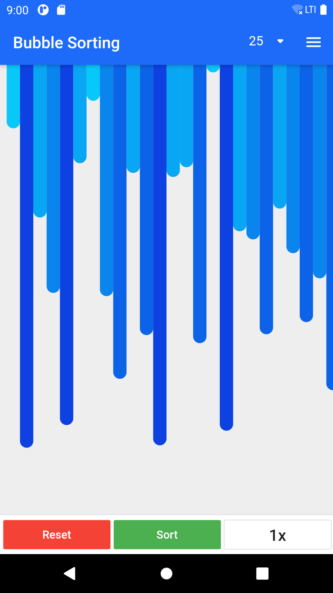
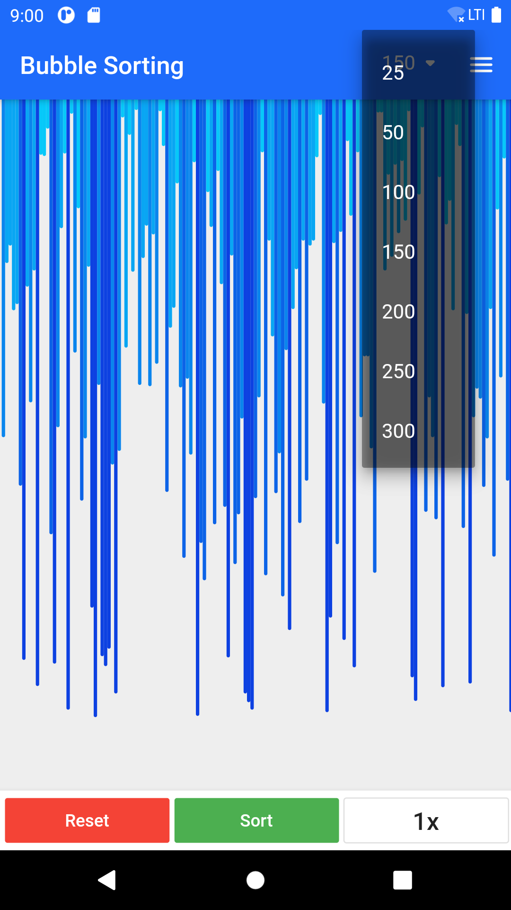
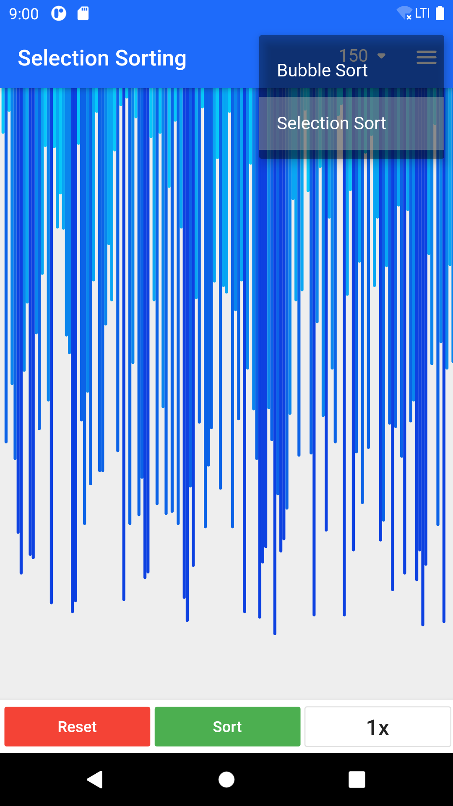

# Sorting_Visualizer_Flutter

Flutter app which visualizes different sorting algorithms. This app is designed to view and also understand the algorithm better using visualization concept.

## Screenshots

**Home Page** where you can view the bars.

Adjust the **Number of Bars**

Select your **Algorithm**

